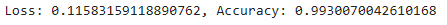
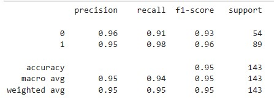
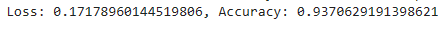
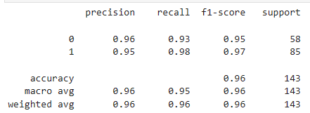
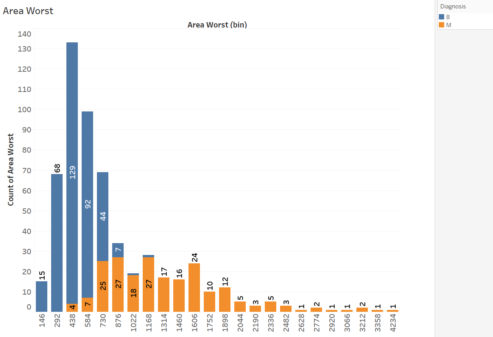

# Breast Cancer Diagnosis 
--------------------------------------
Tumor testing
### Intro
In this project, we were tasked with using Machine Learning to make predictions on a chosen dataset. Our dataset is based on tumors tested for breast cancer and measurements related to those tumors, such as the average and worse smoothness, radius, perimeter. The dataset was chosen as it advises if tumor was malignant (cancerous) or benign  (non-cancerous).

### Method
Given the systems available, our process was as follows:
- Load dataset into DataFrame using Python/Pandas
- Clean-up the dataset to a readable format, expressing all necessary values as numbers (0 & 1)
- Use scikit-Learn to train and test the machine learning model, Standard Scalar to scale evenly
- Use Kerastuner library to run trials and optimize the model, with hopes of increasing accuracy
- KNeighbors to clsuter instances of the data
- Compare the model output “classification report” and accuracy scores
- Visualize data using Tableau

### Results
- Below is a display of the classification report based on the Dataframe that is specifically the measures of the tumors at their worse size (largest) and the mean size. 
- As indicated below, the accuracy increased in most cases once the data was optimized with the trials using the kerastuner library for both the mean and worse  measurement figures.
- This trial was ran many times and the numbers did change a bit everytime, but all stayed within that same range of at least a 91-99% accurracy. This confirmed the model used for predictions is efficient and a great tool to use to make these predictions on this scale.

### Optimized Accuracy score: Worst Measures
-------------------------------------------

#### Classification Report for Worst (measures) DataFrame

### Optimized Accuracy score: Average Measures
------------------------------------------------ 

#### Classification Report for Mean (average measures) DataFrame
 

We also created visualizations for further analysis.
  - These visualizations all confirm our predictions: that the size of the tumor is a great predictor of the type of tumor: malignant or benign. The larger the tumor,     the higher the chance of malignancy. This also concurs with the accuracy of the model used to make predictions based on this given dataset.
  

